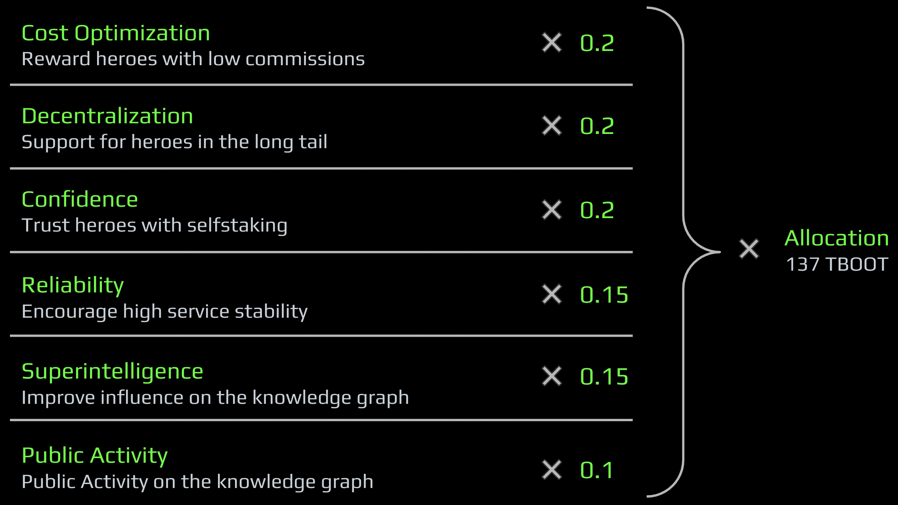

# Delegation strategy for cyber~congress

The toolkit provides a delegation strategy for `bostrom` heroes from cyber~congress multisig.

The aim is to build a strong hero set by endorsing their stake with cyber\~congress power. According to cyber\~congress values, decentralization, confidence, reliability, and superintelligence will be encouraged. Also, additional delegations from cyber~congress will help cover maintainance of validators running costs.

The toolkit should help distribute multisig tokens in the correct way and to automatize the delegation/redelegation/unbonding processes.

The result of the tool execution is a pivot table with all calculations in detail and unsigned transaction files for signing and broadcasting.

## Criteria

The allocation of the delegation strategy program is 135 TBOOT.

```python
ALLOCATION = 135_000_000_000_000
```

The criteria shares are:

```python
COST_OPTIMIZATION = 0.30
DECENTRALIZATION = 0.20
CONFIDENCE = 0.20
RELIABILITY = 0.15
SUPERINTELLIGENCE = 0.15
```

```python
JAILED_WINDOW = 200_000 # blocks
NUMBER_OF_JAILS_FOR_KICKOFF = 2
BLACK_LIST = []
MSGS_IN_TX = 3 # maximum for Ledger nano x with cybercli
DELEGATOR_ADDRESS = 'bostrom1xszmhkfjs3s00z2nvtn7evqxw3dtus6yr8e4pw'
```

## Cost optimization

Each hero decides which commission he wants to grab from their delegators. The mechanics provides resources for heroes to maintain their nodes in a highly reliable way. Some heroes skip this simple rule and keep zero-fee validators online for some kind of advertisement. On the other hand, some of the validators increase their commission rates up to 100%. Both of these cases are not encouraged. The distribution function for cost endorsement will be:

```python
def get_cost_optimization_endorsement(
        cost_optimization,
        cost_optimization_sum,
        ):
    return int(cost_optimization / cost_optimization_sum * ALLOCATION * COST_OPTIMIZATION)
```

where:
`cost_optimization_sum` is the sum of `cost_optimization` for all heroes
`cost_optimization` is:

```python
def get_cost_optimization(commission: float):
    if 0.01 <= commission <= 0.10:
        return 1 / (commission**2)
    else:
        return 0
```

This is a very easy function that gives a hero `1 / (commission**2)` if his commission rate is between 1% and 10% and gives 0 points otherwise. 

## Decentralization

This criterion precedes the following goals:

- Increasing the number of heroes that can halt the network
- Increasing the number of heroes that can fork the network
- Supporting validators in the long tail, including sets of inactive heroes

The idea is to rank validators descending by staked tokens and to give them weighted points:

```python
def get_decentralization(rank):
    return rank
```

Then, distribute tokens:

```python
def get_decentralization_endorsement(decentralization, decentralization_sum):
    return int((decentralization / decentralization_sum) * ALLOCATION * DECENTRALIZATION)
```

## Confidence

The hero's confidence shows the relationship between the tokens that the hero has delegated to himself and the tokens that are delegated to him by the community. If the hero is not ready to put tokens on the validator he supports, then his confidence level is low. That is why only those heroes who believe in themselves will be encouraged.

```python
def get_confidence(ownership):
    return 1 - (1 / (1e-32 ** (-ownership)))
```

And the distribution is:

```python
def get_confidence_endorsement(confidence, confidence_sum):
    return int((confidence / confidence_sum) * ALLOCATION * CONFIDENCE)
```

## Superintelligence

This criterion shows the power of the hero or the product of Volts and Amperes owned by the validator.

```python
import math

def get_superintelligence(power):
    return math.log10(power + 1)
```

The distribution is:

```python
def get_superintelligence_endorsement(superintelligence, superintelligence_sum):
    return int((superintelligence / superintelligence_sum) * ALLOCATION * SUPERINTELLIGENCE)
```

## Reliability

The most complex criteria. It should help to understand the sustainability of the hero node set-up.

Here the subcriteria will be defined:

- jails
- tokens blurring

`jails` is the amount of `unjail` transactions from the hero. In other words, this subcriterion is about how many times the validator was jailed for some kind of misbehavior in the `JAILED_WINDOW`.

`tokens blurring` is the ratio between `staked` and `delegator_shares` tokens. It shows how many tokens a validator lost because of slashing. 

The sum of the normed of that subcriteria forms reliability criteria:

```python
def get_reliability(jails, staked, delegator_shares):
    tokens_bluring = staked / delegator_shares
    if tokens_bluring == 1 and jails == 0:
        return 3
    else:
        return 1 / 2 ** jails + tokens_bluring ** 2
```

The token loss is very serious misconduct. If the validator didn't lose anything, the `tokens_blurring` will be equal to 1. Also, if the amount of `jails` during the `JAILED_WINDOW` is `0`, validator gets 3 points. Otherwise the halving function for jails and square for `tokens_blurring` are using.

The distribution is:

```python
def get_reliability_endorsement(reliability, reliability_sum):
    return int((reliability / reliability_sum) * ALLOCATION * RELIABILITY)
```

## Black list

In that list heroes who are quitting will be placed.

## Usage (python3 required)

0. Install requirements

```bash
pip3 install -r requirements.txt
```

1. Fill `config.py`

2. Run script

```bash
python3 redelegation.py
```

The result of the script execution is .csv file with pivot table

## What's going on???

1. The script gets all validators from the network

2. Ranks them by tokens (voting power)

3. Kicks off jailed validators

4. Kicks off validators with number of jails in `JAILED_WINDOW` more than `NUMBER_OF_JAILS_FOR_KICKOFF`.

5. Kicks off heroes from the `BLACK_LIST`

6. Calculates endorsements and sorts heroes descending by total

7. Saves pivot table in `./delegation_strategy.csv`

8. Generates unsigned transactions by `MSGS_IN_TX` messages in transaction from `DELEGATOR_ADDRESS` address. 

## Example calculations

[Here](./delegation_strategy.csv) is the result of script execution for 2022-05-17.

## Signing transactions with the multisig
You can learn how multisig works by CLI in the [guide](https://github.com/cybercongress/go-cyber/blob/main/docs/multisig_guide.md), 
below are examples regarding transactions of this repository.

1. Sign transaction from multisig participants
```bash
cyber tx sign txs/unsigned_0.json --multisig=$MULTISIG_NAME --from=$WALLET_NAME --output-document=txs/signed_0_1.json --chain-id=bostrom --node https://rpc.bostrom.cybernode.ai:443
```
2. Create combined multisig transaction
```bash
cyber tx multisign txs/unsigned_0.json $MULTISIG_NAME txs/signed_0_1.json txs/signed_0_2.json --chain-id=bostrom --node https://rpc.bostrom.cybernode.ai:443 &> txs/signed_combined_0.json
```
3. Broadcast transaction
```bash
cyber tx broadcast txs/signed_combined_0.json --chain-id=bostrom --node https://rpc.bostrom.cybernode.ai:443 --broadcast-mode block
```
        
